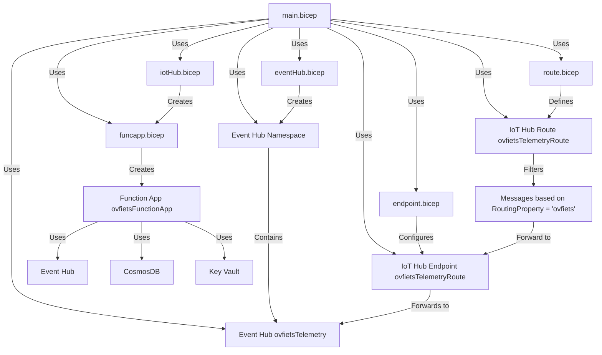

```mermaid
graph TD;
    A[main.bicep] -->|Uses| B[iotHub.bicep];
    A[main.bicep] -->|Uses| C[eventHub.bicep];
    A[main.bicep] -->|Uses| D[endpoint.bicep];
    A[main.bicep] -->|Uses| E[route.bicep];
    A[main.bicep] -->|Uses| F[funcapp.bicep];
    A[main.bicep] -->|Uses| G[storage.bicep];
    A[main.bicep] -->|Uses| H[cosmos.bicep];
    A[main.bicep] -->|Uses| I[keyvault.bicep];
    A[main.bicep] -->|Uses| J[appinsights.bicep];
    
    B[iotHub.bicep] -->|Creates| F[Azure IoT Hub];
    C[eventHub.bicep] -->|Creates| G[Event Hub Namespace];
    G[Event Hub Namespace] -->|Contains| H[Event Hub ovfietsTelemetry];
    
    D[endpoint.bicep] -->|Configures| I[IoT Hub Endpoint ovfietsTelemetryRoute];
    I[IoT Hub Endpoint ovfietsTelemetryRoute] -->|Forwards to| H[Event Hub ovfietsTelemetry];
    
    E[route.bicep] -->|Defines| J[IoT Hub Route ovfietsTelemetryRoute];
    J[IoT Hub Route ovfietsTelemetryRoute] -->|Filters| K[Messages based on RoutingProperty = 'ovfiets'];
    K[Messages based on RoutingProperty = 'ovfiets'] -->|Forward to| I[IoT Hub Endpoint ovfietsTelemetryRoute];

    F[funcapp.bicep] -->|Creates| L[Function App ovfietsFunctionApp];
    L[Function App ovfietsFunctionApp] -->|Uses| M[Event Hub]  ;
    L[Function App ovfietsFunctionApp] -->|Uses| N[CosmosDB];
    L[Function App ovfietsFunctionApp] -->|Uses| O[Key Vault];
```

